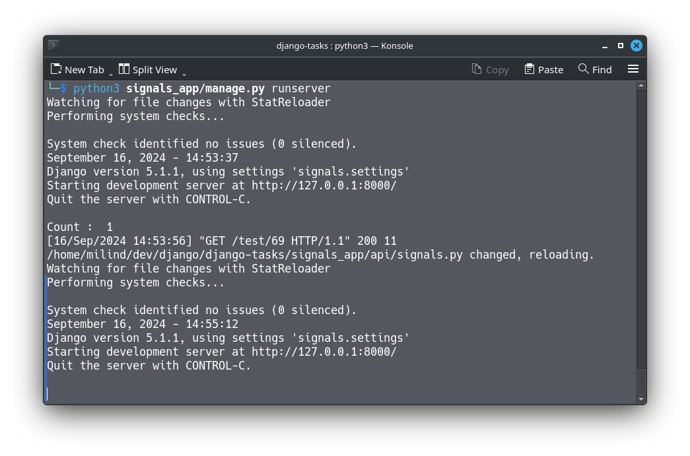
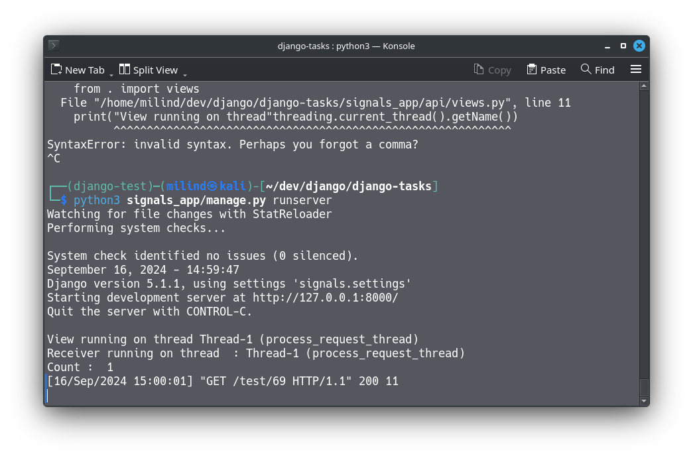
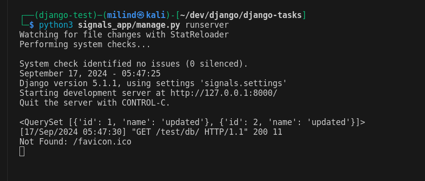
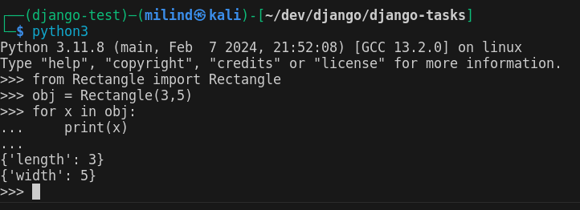

# AccuKnox Report

# Contents

- [Setting up the Django project](https://www.notion.so/AccuKnox-Report-6b4d3401c0e843e1b826216826824450?pvs=21)
- [Django Signals](https://www.notion.so/AccuKnox-Report-6b4d3401c0e843e1b826216826824450?pvs=21)
    - [Q1](https://www.notion.so/AccuKnox-Report-6b4d3401c0e843e1b826216826824450?pvs=21)
    - [Q2](https://www.notion.so/AccuKnox-Report-6b4d3401c0e843e1b826216826824450?pvs=21)
    - [Q3](https://www.notion.so/AccuKnox-Report-6b4d3401c0e843e1b826216826824450?pvs=21)
- [Custom classes](https://www.notion.so/AccuKnox-Report-6b4d3401c0e843e1b826216826824450?pvs=21)

# Setting up the Django Project

- Clone this repo
- change to the directory signals_app to find the project
- `python3 [manage.py](http://manage.py) makemigrations api`
- `python3 [manage.py](http://manage.py) migrate`
- `python3 [manage.py](http://manage.py) runserver`
- You can now proceed to head below and go to the specified endpoints

# Signals

**Q1 )** Are django signals synchronous or asynchronous by default ?

**A)** They are synchronous by default for a single request context. In case you do want to make it asynchronous , you’ll have to take the help of some libraries. 

This means that for a single request , the receiver functions for the signal gets executed sequentially in the specified order.

i have created an event where the user passes a number as an argument . if the number = 69 , then the receiver functions are triggered. I have 2 receivers listening for the same event . When these get triggered , you can see that  they always execute in the order they are given in the source code. 

To show this , i have made the one of the receiver wait for 10 seconds , before the second receiver starts executing. Now when we send a request to the end point that triggers this event, we can see the first function **signal_handler_0** gets executed, increments a simple counter, sleeps for 10 seconds , then **signal_handler()** is executed , printing the count variable. 

Send a request to [http://127.0.0.1:8000/test/69](http://127.0.0.1/test/69) to test this

You will see the “count <value” in the terminal after 10 seconds

**Q2)**  Do django signals run in the same thread as the caller?

A) Yes . We can check this by using the python built in library called threading.

Using this module , we can check what thread the current piece of code is running on. With this , I extract the thread from the  view that triggers a signal and also from the receiver functions . 

We see that both returns the same thread . This implies that the caller and receiver both runs on the same thread

Send a request to  [http://127.0.0.1:8000/test/69](http://127.0.0.1/test/69)  and observer the output in the terminal 

You will get the thread in which the view and the receiver is running on 

**Q3)**  Do django signals run in the same database transaction as the caller?

**A)** Yes. The receiver function modifies the same model object that was part of the initial operation that occurred in the view that triggered the receiver. 

To show this , i have created a view that would create a model entry initially with the name Book1.

on object create signal ,  a receiver function gets executed that would modify the entity that was just created . 

This implies that the signals run on the same transaction 

To test this , send a request to [http://127.0.0.1:8000/test/db](http://127.0.0.1:8000/test/db) 

You will see that the name of the book instance have changed

# Custom classes

You can find the code at [Rectangle.py](http://Rectangle.py) 

## Output:

